## ES2015 class

ES2015 이전까지는 비슷한 종류의 객체를 많이 만들어내기 위해 **생성자**를 사용해왔습니다.

```js
// 생성자
function Person({name, age}) {
  this.name = name;
  this.age = age;
}
Person.prototype.introduce = function() {
  return `안녕하세요, 제 이름은 ${this.name}입니다.`;
};

const person = new Person({name: '윤아준', age: 19});
console.log(person.introduce()); // 안녕하세요, 제 이름은 윤아준입니다.
console.log(typeof Person); // function
console.log(typeof Person.prototype.constructor); // function
console.log(typeof Person.prototype.introduce); // function
console.log(person instanceof Person); // true
```

ES2015에서 도입된 **클래스**는 생성자의 기능을 대체합니다. `class` 표현식을 사용하면, 생성자와 같은 기능을 하는 함수를 훨씬 더 깔끔한 문법으로 정의할 수 있습니다.

```js
// 클래스
class Person {
  // 이전에서 사용하던 생성자 함수는 클래스 안에 `constructor`라는 이름으로 정의합니다.
  constructor({name, age}) {
    this.name = name;
    this.age = age;
  }

  // 객체에서 메소드를 정의할 때 사용하던 문법을 그대로 사용하면, 메소드가 자동으로 `Person.prototype`에 저장됩니다.
  introduce() {
    return `안녕하세요, 제 이름은 ${this.name}입니다.`;
  }
}

const person = new Person({name: '윤아준', age: 19});
console.log(person.introduce()); // 안녕하세요, 제 이름은 윤아준입니다.
console.log(typeof Person); // function
console.log(typeof Person.prototype.constructor); // function
console.log(typeof Person.prototype.introduce); // function
console.log(person instanceof Person); // true
```

`class` 블록에서는 JavaScript의 다른 곳에서는 사용되지 않는 **별도의 문법**으로 코드를 작성해야 합니다. 함수 혹은 객체의 내부에서 사용하는 문법과 혼동하지 않도록 주의하세요.

```js
// 클래스는 함수가 아닙니다!
class Person {
  console.log('hello');
}
// 에러: Unexpected token
```

```js
// 클래스는 객체가 아닙니다!
class Person {
  prop1: 1,
  prop2: 2
}
// 에러: Unexpected token
```


문법이 아니라 동작방식의 측면에서 보면, ES2015 이전의 생성자와 ES2015의 클래스는 다음과 같은 차이점이 있습니다.

- 클래스는 **함수로 호출될 수 없습니다.**
- 클래스 선언은 `let`과 `const`처럼 **블록 스코프**에 선언되며, **호이스팅(hoisting)**이 일어나지 않습니다.
- 클래스의 메소드 안에서 **`super` 키워드**를 사용할 수 있습니다.

## 메소드 정의하기

클래스의 메소드를 정의할 때는 객체 리터럴에서 사용하던 문법과 유사한 문법을 사용합니다.

인스턴스 메소드(instance method)는 다음과 같은 문법을 통해 정의합니다.

```js
class Calculator {
  add(x, y) {
    return x + y;
  }
  subtract(x, y) {
    return x - y;
  }
}
```

객체 리터럴의 문법과 마찬가지로, 임의의 표현식을 **대괄호**로 둘러싸서 메소드의 이름으로 사용할 수도 있습니다.

```js
const methodName = 'introduce';
class Person {
  constructor({name, age}) {
    this.name = name;
    this.age = age;
  }
  // 아래 메소드의 이름은 `introduce`가 됩니다.
  [methodName]() {
    return `안녕하세요, 제 이름은 ${this.name}입니다.`;
  }
}

console.log(new Person({name: '윤아준', age: 19}).introduce()); // 안녕하세요, 제 이름은 윤아준입니다.
```

**Getter 혹은 setter**를 정의하고 싶을 때는 메소드 이름 앞에 `get` 또는 `set`을 붙여주면 됩니다.

```js
class Account {
  constructor() {
    this._balance = 0;
  }
  get balance() {
    return this._balance;
  }
  set balance(newBalance) {
    this._balance = newBalance;
  }
}

const account = new Account();
account.balance = 10000;
account.balance; // 10000
```

`static` 키워드를 메소드 이름 앞에 붙여주면 해당 메소드는 **정적 메소드**가 됩니다.

```js
class Person {
  constructor({name, age}) {
    this.name = name;
    this.age = age;
  }
  // 이 메소드는 정적 메소드입니다.
  static sumAge(...people) {
    return people.reduce((acc, person) => acc + person.age, 0);
  }
}

const person1 = new Person({name: '윤아준', age: 19});
const person2 = new Person({name: '신하경', age: 20});

Person.sumAge(person1, person2); // 39
```

Generator 메소드를 정의하려면, 메소드 이름 앞에 `*` 기호를 붙여주면 됩니다.

아래와 같이 `Symbol.iterator` 메소드를 generator로 정의해주면, 클래스의 인스턴스를 쉽게 iterable로 만들 수 있습니다.

```js
class Gen {
  *[Symbol.iterator]() {
    yield 1;
    yield 2;
    yield 3;
  }
}

// 1, 2, 3이 차례대로 출력됩니다.
for (let n of new Gen()) {
  console.log(n);
}
```

## 클래스 필드 (Class Field)

클래스 블록 안에서 할당 연산자(`=`)를 이용해 인스턴스 속성을 지정할 수 있는 문법을 **클래스 필드(class field)**라고 합니다.

```js
class Counter {
  static initial = 0; // static class field
  count = Counter.initial; // class field
  inc() {
    return this.count++;
  }
}

const counter = new Counter();
console.log(counter.inc()); // 0
console.log(counter.inc()); // 1

Counter.initial = 10;
console.log(new Counter().count); // 10
```

클래스 필드는 아직 정식 표준으로 채택된 기능은 아닙니다.[^1] 아직 이 기능을 구현한 브라우저는 없는 상태이고, Babel, TypeScript 등의 트랜스파일러를 통해 일부 기능을 사용할 수 있습니다.

### 클래스 필드와 this

`class` 블록은 새로운 블록 스코프를 형성하고, 이 내부에서 사용된 `this`는 인스턴스 객체를 가리키게 됩니다.

```js
class MyClass {
  a = 1;
  b = this.a;
}

new MyClass().b; // 1
```

이 성질을 이용하면, **화살표 함수를 통해서 메소드를 정의할 수 있습니다.** (화살표 함수 안에서의 `this` 키워드는 바로 바깥쪽 스코프에 존재하는 `this`와 같은 객체를 가리킨다는 사실을 떠올려보세요.)

```js
class MyClass {
  a = 1;
  getA = () => {
    return this.a;
  }
}

new MyClass().getA(); // 1
```

이렇게만 보면 일반적인 메소드와 별로 차이가 없어 보이지만, 사실 동작방식 측면에서 굉장히 큰 차이점이 있습니다.

1. 일반적인 메소드는 클래스의 `prototype` 속성에 저장되는 반면, **클래스 필드는 인스턴스 객체에 저장됩니다.**
2. 화살표 함수의 `this`는 호출 형태에 관계없이 항상 인스턴스 객체를 가리키게 됩니다.

2번 성질때문에, **메소드를 값으로 다루어야 할 경우**에는 일반적인 메소드 대신 화살표 함수가 사용되는 경우가 종종 있습니다. 다만, 일반적인 메소드와 달리, 클래스 필드를 통해 정의한 메소드는 **인스턴스를 생성할 때마다 새로 생성되기 때문에** 메모리를 더 차지하게 되므로 주의해서 사용해야 합니다.

## 클래스 상속 (Class Inheritance)

클래스 상속(class inheritance, subclassing) 기능을 통해 한 클래스의 기능을 다른 클래스에서 **재사용**할 수 있습니다.

```js
class Parent {
  // ...
}

class Child extends Parent {
  // ...
}
```

위 코드에서, `extends` 키워드를 통해 `Child` 클래스가 `Parent` 클래스를 상속했습니다. 이 관계를 보고 '부모 클래스-자식 클래스 관계' 혹은 '슈퍼 클래스(superclass)-서브 클래스(subclass) 관계'라고 말하기도 합니다.

어떤 클래스 A가 다른 클래스 B를 상속받으면, 다음과 같은 일들이 가능해집니다.

- 자식 클래스 A를 통해 부모 클래스 B의 **정적 메소드와 정적 속성**을 사용할 수 있습니다.
- 부모 클래스 B의 **인스턴스 메소드와 인스턴스 속성**을 자식 클래스 A의 인스턴스에서 사용할 수 있습니다.

```js
class Parent {
  static staticProp = 'staticProp';
  static staticMethod() {
    return 'I\'m a static method.';
  }
  instanceProp = 'instanceProp';
  instanceMethod() {
    return 'I\'m a instance method.';
  }
}

class Child extends Parent {}

console.log(Child.staticProp); // staticProp
console.log(Child.staticMethod()); // I'm a static method.

const c = new Child();
console.log(c.instanceProp); // instanceProp
console.log(c.instanceMethod()); // I'm a instance method.
```

### super

앞서 봤듯이, 자식 클래스에서 부모 클래스의 정적 속성과 인스턴스 속성에 접근할 수 있었습니다. 하지만, 자식 클래스에 **같은 이름의 속성**을 정의한 경우 문제가 생깁니다.[^2]

```js
class Melon {
  getColor() {
    return '제 색깔은 초록색입니다.';
  }
}

class WaterMelon extends Melon {
  getColor() {
    return '속은 빨강색입니다.';
  }
}

const waterMelon = new WaterMelon();
waterMelon.getColor(); // 속은 빨강색입니다.
```

이런 경우에, `super` 키워드를 통해 부모 클래스의 메소드에 직접 접근할 수 있습니다.

```js
class Melon {
  getColor() {
    return '제 색깔은 초록색입니다.';
  }
}

class WaterMelon extends Melon {
  getColor() {
    return super.getColor() + ' 하지만 속은 빨강색입니다.';
  }
}

const waterMelon = new WaterMelon();
waterMelon.getColor(); // 제 색깔은 초록색입니다. 하지만 속은 빨강색입니다.
```

`super` 키워드의 동작 방식은 다음과 같습니다.

- 생성자 내부에서 `super`를 함수처럼 호출하면, 부모 클래스의 생성자가 호출됩니다.
- 정적 메소드 내부에서는 `super.prop`과 같이 써서 부모 클래스의 `prop` 정적 속성에 접근할 수 있습니다.
- 인스턴스 메소드 내부에서는 `super.prop`과 같이 써서 부모 클래스의 `prop` 인스턴스 속성에 접근할 수 있습니다.

```js
class Person {
  constructor({name, age}) {
    this.name = name;
    this.age = age;
  }
  introduce() {
    return `제 이름은 ${this.name}입니다.`
  }
}

class Student extends Person {
  constructor({grade, ...rest}) {
    // 부모 클래스의 생성자를 호출할 수 있습니다.
    super(rest);
    this.grade = grade;
  }
  introduce() {
    // 부모 클래스의 `introduce` 메소드를 호출할 수 있습니다.
    return super.introduce() + ` 저는 ${this.grade}학년입니다.`;
  }
}

const s = new Student({grade: 3, name: '윤아준', age: 19});
s.introduce(); // 제 이름은 윤아준입니다. 저는 3학년입니다.
```

## 클래스 상속과 프로토타입 상속

클래스 상속은 내부적으로 프로토타입 상속 기능을 활용하고 있습니다. 아래 코드의 클래스 상속에 대한 프로토타입 체인을 그림으로 나타내보면 다음과 같이 됩니다.

```js
class Person {}
class Student extends Person {}
const student = new Student();
```



[^1]: 클래스 필드 제안 사항에 대한 공식 명세는 [이 링크](https://tc39.github.io/proposal-class-fields/)를, 브라우저 지원 여부는 [이 링크](http://kangax.github.io/compat-table/esnext/)를 참고하세요.
[^2]: 이와 같이 부모 클래스의 메소드와 이름이 같은 메소드를 자식 클래스에 정의하는 것을 보고 **메소드 오버라이딩(method overriding)**이라고 합니다.
